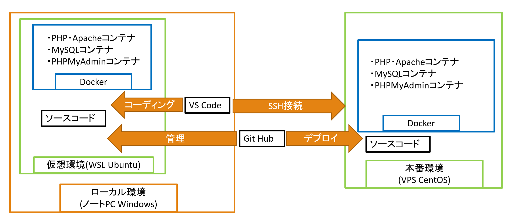
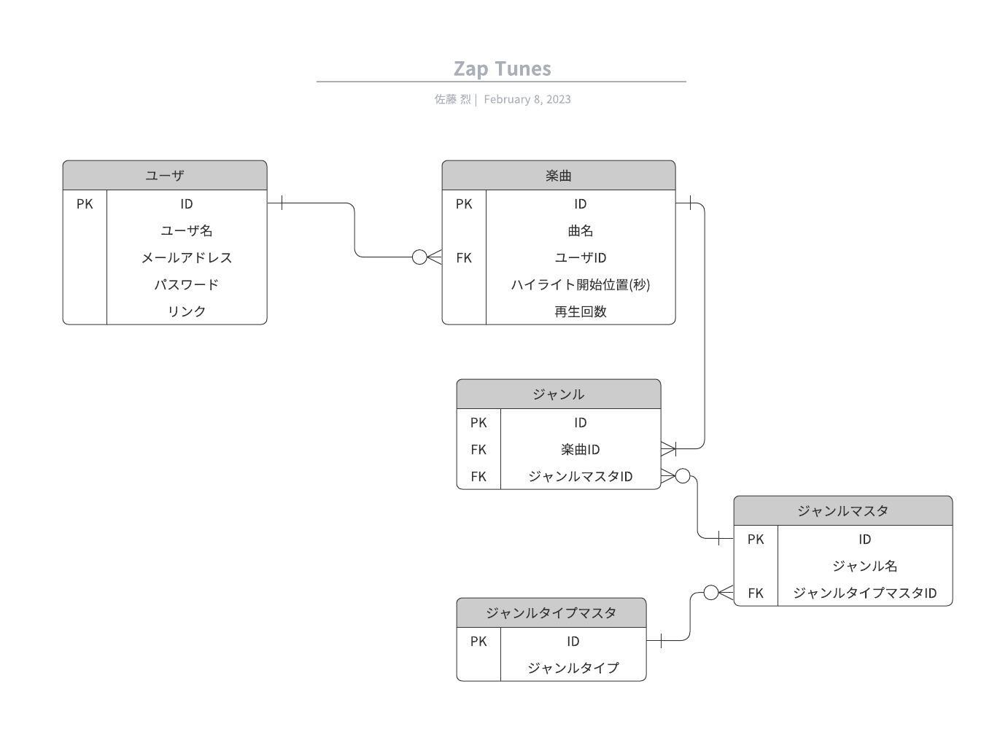

# アプリ概要

「Zap Tunes」は，自作の楽曲を誰かに聞いてほしい人・自分の知らない楽曲を聞きたい人のためのWebアプリです。 アップロードされた楽曲を、簡単な操作で次々と聞くことができます。

# 使用技術

| 名前           | バージョン |
| :------------- | ---------: |
| PHP            |     8.0.30 |
| Laravel        |     9.47.0 |
| MySQL          |     5.7.44 |
| Vue.js         |     3.2.45 |
| Docker         |     23.0.0 |
| Docker Compose |     2.15.1 |

# インフラ構成

# ER 図

- 「ジャンルタイプマスタ」には、ジャンルを大別するタイプ(e.g. 音楽ジャンル・楽器・雰囲気)には何が存在するかを格納します。
- 「ジャンルマスタ」には、どのようなジャンル(e.g. ロック・楽しい)が存在するかを格納します。
- 「ジャンル」には、各楽曲はどのジャンル(e.g. ロック・楽しい)に属するかを格納します。1 つの楽曲にたいしてジャンルは複数選択可能です。

# 機能一覧

- 楽曲再生機能
  - 再生ジャンル選択
  - 曲名・作曲者情報表示
  - ハイライト箇所再生
  - 頭送り
  - 一時停止
  - 次曲自動再生

- 楽曲アップロード機能
  - 曲名入力
  - ハイライト箇所指定
  - 楽曲ジャンル指定(複数選択可)
  - 楽曲とユーザ情報との紐づけ(ユーザ名、URLの自動入力)